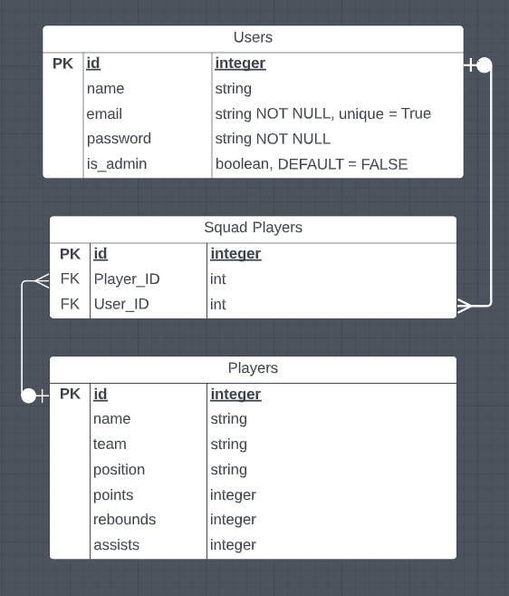
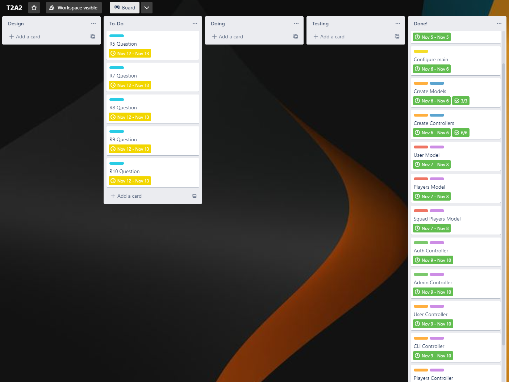

# **NBA Fantasy API Webserver**
## **T2A2 - Timothy Nguyen**

## Table Of Contents

  - [R1: Identification of the problem you are trying to solve by building this particular app](#r1)
  - [R2: Why is it a problem that needs solving?](#r2)
  - [R3: Why have you chosen this database system. What are the drawbacks compared to others?](#r3)
  - [R4: Identify and discuss the key functionalities and benefits of an ORM](#r4)
  - [R5: API Endpoint Documentation](#r5)
  - [R6: Entity Relationship Diagram](#r6)
  - [R7: Third party services](#r7)
  - [R8: Describe your projects models in terms of the relationships they have with each other](#r8)
  - [R9: Discuss the database relations to be implemented in your application](#r9)
  - [R10: Describe the way tasks are allocated and tracked in your project](#r10)
  - [Installation and Setup](#installation-and-setup)
  - [References](#references)

---

## **R1**
### **Identification of the problem you are trying to solve by building this particular app**
---
The purpose of this project is to provide a functioning webserver for people who play in a fantasy league for the NBA. Fantasy NBA is where users will create a league with some friends or some strangers and they take turns in a draft format to pick up a certain amount of players. Each week, your players will accumulate statistics and the user will battle it out with another user's team within their league to see whose team can generate the highest stats. This server provides a centralised place for users to compare statistics of NBA players across the league as well as add players to a team. It also allows users to view how other users have set their teams and see if that would work better than their current lineup. Currently on fantasy websites, there is no function to compare teams with any players currently outside of your own fantasy league and this would be a fantastic place for users to do so. This is a problem for fantasy users as they can only see how teams are built within their own league. Administrators will be adding in players as well as updating their information and statistics on the platform. This ensures that the information provided will be accurate making users more inclined to user the web server. This project aims to provide a way to fill in the missing features that generic fantasy websites are missing.


---

## R2 
### **Why is it a problem that needs solving?**

This is a problem that needs solving as it provides a larger insight than what can be gained from generic fantasy websites. Generic fantasy websites for NBA only allows users to view other teams that are in their own league. By being able to view other user's teams that are not within their league, players can get an insight on any 'meta' players or 'hidden gems' that people in other leagues have found. This will allow users to gain a competitive edge within their own league. Further, the server gives a quality database with up-to-date statistics of players which the user's can put research time into. The project main aim is to give the users that extra edge by:

1. Providing information about all the players
2. Allowing users to compare teams with players not within their league
3. Providing a way for users to test out players within their team without changing their one on their fantasy website

---

## R3 
### **Why have you chosen this database system. What are the drawbacks compared to others?**

Deciding a database system is one of the first decisions when making an application, since data and how data is store is an important factor in what technologies may be used in an application. How the data is manipulated and accessed further dictates the technologies used. There are two main categories of database systems which are, Relational Databases Management Systems (RDBMS) and NoSQL (Not only SQL). RDBMS stores the data within a table format whilst NoSQL stores the data in document format.

In this web server project, the database system used is PostgreSQL which is a Relational Database Management System. It uses Structured Query Language to make queries in the database. Since PostgreSQL is open-sourced, this allows it to be very cost-effective compared to other licensed RDBMS. Further, due to being open-sourced, there are many libraries available as well as tutorials, making it very reliable. PostgreSQL also is very robust in its language support and allows multiple programming languages to write database functions. In this project, Python was used which works well with the Flask framework. Another major advantage of PostgreSQL is that it is very scalable for when a developer would like to make the application larger as well as increasing the data types that it can take due to supporting a large amount of data types.

However, PostgreSQL does have its drawbacks. Due to its robust compatibility with many languages, PostgreSQL may run slower than alternatives when used in read-heavy tasks. Also, due to MySQL's popularity, comparitively, PostgreSQL has less third party tools used. The expense of speed from the robust compatibility is also due to the reason that PostgreSQL allocates 10 mB of data to every new user. Once the user base has grown significantly, this may slow the performance leading to bad user experience which is one of the worst things a developer can encounter for their server.

NoSQL databases have a schema that allows flexibility in data fields. Since the data that we were using in this project did not require this flexibility, PostgreSQL was used. Flexibility is advantageous for databases with changing data inputs. NoSQL databases are also very efficient when processes huge amounts of data, but due to knowing how much data will be used as well as knowing the user base and traffic, PostgreSQL was decided to be used here.

---

## R4 
### **Identify and discuss the key functionalities and benefits of an ORM**

An Object Relational Mapper (ORM) is a language specific code library that acts as an intermediary between the data that is stored and the objects that are used by the code. It's main use is that it has the ability for mapping this data to the object. This is advantageous to developers as it allows them to use their programming language to perform CRUD operations on the object instead of using SQL statements, thus speeding up the development of the project. 'Hydration' is the term for using an ORM to read or manipulate the data within the database. It converts each value into an object property and that property is read or manipulated, stored and then committed back to the database. An advantage to this is allows the developer to change RDBMS databases without causing major issues to the code if this is what the developer intends to do. Although that is possible, it is not good practise to switch databases in a production environment as errors that haven't been tested in development may occur. One more major benefit of ORM is that it uses sanitation of data inputs which in turn provides moderate protection from SQL injections from malicious attackers. The drawback is that it only protects from SQL injections and not injections with a programming language.


Below is an example of an SQL query and the same query written in Python with SQLAlchemy as the ORM:

SQL:

```SQL
SELECT *
FROM user
WHERE user_id = '1'
```

Python:

```python
stmt = db.select(User).filter_by(user_id=1)
user = db.session.scalars(stmt)
```

---

## R5 
### **API Endpoint Documentation**

Here is the [API Endpoint Documentation](docs/API-Endpoints.md) for the project.

---

## R6 
### **ERD**



[Go to R9](#r9)

---

## R7 
### **Third party services**
This project utilises some third party services and PyPI packages. All dependencies and the dependencies of the third party services are frozen into the [requirements.txt](requirements.txt) file. A Pypi link is provided for each of the packages listed below.

- [SQLAlchemy](https://pypi.org/project/SQLAlchemy/)
    - SQLAlchemy is the SQL toolkit and ORM written in python which implements a bridge between the application code and the PostgreSQL databse. Object Relational Mapper (ORM) is used to map the tables in the database to a Python class object model and vice versa. This allows us to use CRUD (create, read, update, delete) operations on the database.
- [Flask-Marshmallow](https://pypi.org/project/flask-marshmallow/)
    - Flask marshmallow is a third-party library used in the project. It allows the conversion of the JSON datatypes to and from Python datatypes in the project. It also uses schemas to make use of validation methods within the code, where input fields must conform to a specified constraint. 
- [Flask-Bcrypt](https://pypi.org/project/Flask-Bcrypt/)
    - Bycrypt is a third-party library that allows the developer to protect passwords stored in the database by using bcrypt hashing functions. By passing the value of the password through an algorithm, it maps the value to an encrypted string. Bcrypt was mainly used to store passwords data safely in the project.
- [Flask-JWTExtended](https://pypi.org/project/Flask-JWT-Extended/)
    - JWT Extended is the third-party library used to create tokens that allow authenticated uses to access the API when the tokens match. By setting an expiry of 24 hours for the token for authentication, users can stay logged in for up to 24 hours without having to enter their login inputs every time they want to access a part of the website that requires a login.  It also checks the tokens to allow/deny access to certain elements of the site, as well as checking users for administrative privileges.
- [psycopg2](https://pypi.org/project/psycopg2/)
    - Psycopg2 is the PostgreSQL database adapter for Python. This allowed the Python app to use database queries on the database.
- [python-dotenv](https://pypi.org/project/python-dotenv/)
    - Python-dotenv is the third-party library that is used to set environment variables taken from the .env files. It automatically reads the key-value pairs and configures the environment variables automatically.
- [pip-review](https://pypi.org/project/pip-review/)
    - pip-review was used to list, retrieve and install package updates within the dependencies

---

## R8 
### ****Describe your projects models in terms of the relationships they have with each other****
Three SQLAlchemy models were used in this project to represent the three database entities. These three models were the User mode, player model and the squad model. As showm in R6 in the ERD, their are relationships and constraints that exist between the entities which allow the API to run. The base class db.Model was used for each of the models. Each model has a primary key which was an ID and some use a foreign key to establish a relationship with another model.

Within the application, Squad players exists on the 'many' side of the relationship with Users as well as the 'many' side of the relationship with Players.

- #### **User Model**
The user model is used to represent the users that have registered in the database. The user model does not require a foreign key since a user can exist by themself without adding players to their squad. The user model has a one-to-many relationship with the squad players model since a user can have multiple squad players. 

```python
squads = db.relationship('Squad', back_populates='user')
```

The code shown above shows the relationship between the user model and the squad model. The `db.relationship()` function  creates a two way relationship between the two models allowing them to be available as an object to the other model. Since each player can have multiple squad players, the variable is a plural to indicate that. The `back_populates` argument shows which table that the relationship of squads exists with.

- #### **Player Model**
The player model is used to represent the players and stats that the admin has added. The player model has no connection to the user model as they are not associated. However, the player model is linked to the squad model in a one-to-many as each player can belong to many different squads. The player model does not contain a foreign key.

```python
squads = db.relationship('Squad', back_populates='players')
```
This is the snippet of code that shows the relationship between the squad and players. It is the same as the user model's relationship with the squads as they are both one-to-many. 

- #### **Squad Model**
The Squad model represents any players that users have chosen from the players database and have added to their squad. A user can have many squad players so the relationship between the squad-to-user is many-to-one. Squad players can also contain many players so that relationship is also many-to-one. Due to these two relations, the squad model contains two foreign keys to connect to the user model and the player model respectively.

```python
player_id = db.Column(db.Integer, db.ForeignKey('players.id'), nullable=False)
user_id = db.Column(db.Integer, db.ForeignKey('users.id'), nullable=False)
```
The `player_id` variable is created with the `db.Column()` function. The `db.Integer()` makes sure that it is an integer input. The SQLAlchemy function `db.ForeignKey()` is then used to show that this is a foreign key in this model. `nullable` is then set to False as the id cannot be a null input since the player must exist. This is the same for the `user_id` variable. It undergoes the same constraints as mentioned just before since it is also an id number and since the user must exist to have a squad, nullable is also false.


---

## R9 
### **Discuss the database relations to be implemented in your application**
The PostgreSQL database that stores the data for this server contains three tables:
- Users
- Squads
- Players

The relationships within the database can be visualised using the [Entity Relationship Diagram](docs/ERD.png) shown in [Requirement 6](#r6) of this README document. Each table contains a primary key which is a unique identifier for each table entry. The squads table contains two foreign keys which allows a relationship between the squads table with the user table as well as the squads table with the players table. By linking different tables together, this makes it so table entries are not duplicated within all the tables. This process, called 'normalisation' allows for more complex relationships to occur without the redundancy of duplicate entries. The crow's-foot notation of the arrows on the ERD represents the relationship of these tables. Here are all the relationships within the table:

- A user has no relationship to player, so they are not directly connected.
- A user can have none or many squad-players, so there is a 'zero-to-many' relationship to squad. This allows the user to add as many squad players as they would like, or remove them all. The user can simply exist without adding players to their squad.
- A player can be on none or many squads, so there is a 'zero-to-many' relationship with squad. This means the player added, can exist in the database without being added to a squad, but it can also be added to many different squads.
- A squad-player(squad) has a '1-to-1' relationship with user. The squad player can only be assigned to one user as they belong on the squad of that user if they exist. If a user has not added the squad-player, then the squad player will not exist.
- A squad-player(squad) has a '1-to-1' relationship with player. The squad-player must be a player and a squad player cannot exist without the player. As such, one squad player can only be one player.

---

## R10 
### **Describe the way tasks are allocated and tracked in your project**

In this project, Trello was used to manage the development stages of the web server API. A list was first created of the models and controllers to understand what was need to be done. For each user, I wanted to configure all their possible actions and this was done for admins as well. Some cards contained a checklist if they were more complex. Further, I used the colour labels to organise work from least important to most important as well as separated work from API code to setup and initial design. I also put due dates on each task after ordering them and the due dates were stuck to, leading to a complete project. 

The link to the Trello board as well as a screenshot is provided below.

The Trello board linke can be found [here](https://trello.com/invite/b/8ir68SbL/ATTI9095dcedc2f2b65af0fe52dca04ca7c96099DFC9/t2a2).



## **Installation and Setup**

## **References**
